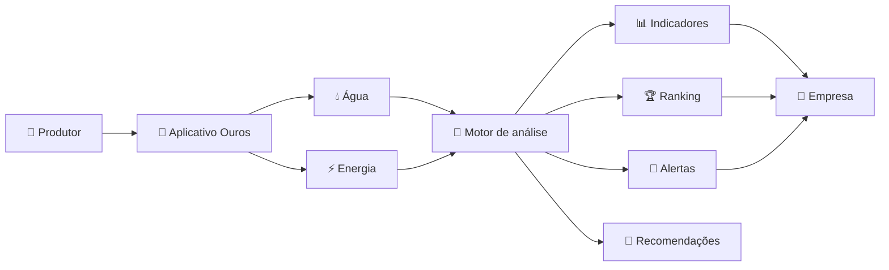
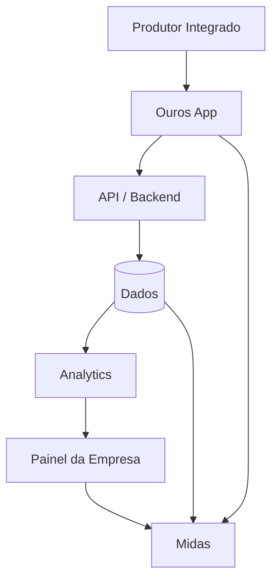

<div align="center">

#  OUROS

### Dados que transformam sustentabilidade em vantagem competitiva.

**Gestão inteligente de água e energia para produtores integrados.**

<br>


</div>

---

## ✦ Sobre o Ouros

**Ouros** é uma plataforma B2B de gestão ambiental criada para aproximar empresas e produtores integrados por meio de dados.

O sistema acompanha o consumo de **água** e **energia** das propriedades rurais e transforma essas informações em indicadores de eficiência, históricos, alertas, rankings e recomendações práticas.

Em vez de comparar fazendas apenas pelo consumo bruto, o Ouros busca medir a **intensidade de uso dos recursos**, relacionando o consumo à produção da propriedade. Assim, produtores de tamanhos diferentes podem ser comparados de forma mais justa.

> **Medir. Comparar. Melhorar.**

---

## 🎯 O problema

Grande parte do impacto ambiental de uma cadeia produtiva pode acontecer fora das fábricas, distribuído entre centenas ou milhares de fornecedores.

Sem dados primários de cada propriedade, empresas acabam dependendo de médias e estimativas, o que dificulta:

- identificar desperdícios;
- comparar fornecedores;
- acompanhar evolução;
- direcionar ações de melhoria;
- reconhecer produtores eficientes;
- prever riscos e consumo futuro.

O Ouros transforma esse buraco negro de informação em um painel operacional.

---

## ⚡ Como funciona



O produtor registra seus dados periodicamente. O aplicativo mantém as informações localmente quando não há internet e sincroniza quando a conexão retorna.

A partir desses dados, o sistema calcula indicadores de eficiência e acompanha a evolução de cada propriedade ao longo dos ciclos produtivos.

---

## 🏆 Ranking sustentável

O Ouros utiliza um sistema de progressão dividido em quatro níveis:

<div align="center">

| Nível | Classificação |
|:---:|:---|
| ⚙️ | **Ferro** |
| 🥉 | **Bronze** |
| 🥈 | **Prata** |
| 🥇 | **Ouro** |

</div>

Cada estado pode possuir seu próprio ranking, reduzindo distorções causadas por diferenças regionais.

O objetivo não é apenas premiar quem já possui bons resultados, mas também reconhecer **quem está melhorando ao longo do tempo**.

---

## 🧠 Principais recursos

### Para o produtor

- 📊 Dashboard de consumo hídrico e elétrico
- 🏆 Ranking sustentável
- 🎯 Metas próprias e metas por estado
- 📈 Histórico de evolução entre ciclos
- 🔔 Alertas de consumo elevado
- 🌱 Recomendações automáticas
- 🧮 Simulador de economia e cenários
- 💰 Gestão financeira do consumo
- 🐣 Controle de lotes
- 💉 Calendário de vacinação
- 📉 Indicador de mortalidade
- 🌦️ Condições climáticas da propriedade
- 📚 Biblioteca de conteúdos
- 🏅 Selos e reconhecimento digital
- 📄 Exportação de relatórios em PDF

### Para a empresa

- 🗺️ Visão consolidada dos fornecedores
- 📊 Indicadores ambientais
- 🚨 Painel de alertas
- 🔎 Identificação de baixa eficiência
- 🏆 Rankings regionais
- 📈 Evolução histórica
- 🔮 Previsibilidade baseada em dados
- 🤝 Canal de suporte técnico

---

## 🤖 Midas

**Midas** é o assistente inteligente do Ouros.

Para o produtor, ele ajuda com dúvidas sobre o aplicativo, indicadores, ranking e funcionalidades.

Para a empresa, ele também pode facilitar consultas sobre desempenho e informações consolidadas dos fornecedores.

---

## 📊 Ouros em números

<!-- STATS:START -->
<div align="center">

| 👥 Equipe | 📦 Repositórios | 🧑‍💻 Linguagens | 📝 Linhas de código |
|:---:|:---:|:---:|:---:|
| **6** | `carregando...` | `carregando...` | `carregando...` |

</div>

<!-- STATS:END -->

> A equipe original do projeto possui **6 integrantes**. As demais métricas podem ser atualizadas automaticamente usando a GitHub API.

---

## 💻 Stack

<!-- LANGUAGES:START -->

As tecnologias abaixo devem ser atualizadas automaticamente de acordo com os repositórios da organização.

```text
Aguardando primeira coleta de métricas...
```

<!-- LANGUAGES:END -->

---

## 📦 Principais repositórios

<!-- REPOS:START -->

| Repositório | Descrição | Stack |
|---|---|---|
| `em breve` | Repositórios principais aparecerão aqui automaticamente. | — |

<!-- REPOS:END -->

---

## 🧩 Visão do produto



---

## 🌎 Impacto

O Ouros foi concebido para transformar sustentabilidade em um processo mensurável.

Ao reunir dados de consumo diretamente das propriedades, a plataforma pode ajudar empresas a:

**reduzir desperdícios → identificar gargalos → acompanhar fornecedores → incentivar evolução → tomar decisões melhores**

Tudo isso mantendo o produtor no centro da experiência.

---

## 📴 Offline first

Conectividade não pode ser requisito absoluto para uma ferramenta voltada ao campo.

Por isso, o Ouros foi pensado para operar mesmo em regiões com sinal limitado:

```text
SEM INTERNET
     ↓
dados permanecem no dispositivo
     ↓
conexão retorna
     ↓
sincronização
     ↓
análise + ranking + dashboards
```

---

## 🔐 Segurança e confiabilidade

Dados de consumo podem revelar informações importantes sobre custos e operação de uma propriedade.

Por isso, a arquitetura do projeto deve priorizar:

- autenticação e autorização;
- criptografia;
- proteção de dados sensíveis;
- validação de registros;
- rastreabilidade;
- sincronização segura;
- controle de acesso por perfil.

---

## 🚧 Desafios

O software não resolve sozinho limitações físicas de infraestrutura.

Entre os principais desafios do projeto estão:

- baixa conectividade em regiões rurais;
- diferenças econômicas e estruturais entre produtores;
- qualidade dos dados enviados;
- resistência à adoção;
- necessidade de suporte e treinamento;
- custo de melhorias físicas nas propriedades;
- construção de critérios de ranking realmente justos.

Esses pontos fazem parte do problema que estamos tentando resolver, não são detalhes escondidos embaixo do tapete.

---

## 👥 Time

<div align="center">

<table>
<tr>
<td valign="top">

| |
|---|
| **Alícia Emi Yamamoto** |
| **André Roger Nogueiro Dias** |
| **Eduardo Ventura Da Cruz** |
| **Fernando Do Nascimento Rodriguez** |
| **Fernando Neto Zaia** |
| **Sofia Deolim Fernandes** |

</td>
<td valign="top">

| |
|---|
| **Júlia Fonseca Watanabe** |
| **Lucas Cayres Porto** |
| **Lucas de Carvalho Ramos** |
| **Marcella de Liberal Alves** |
| **Nicolas Vlad Koyama de Oliveira** |
| **Verena Marostica Marcelino** |

</td>
</tr>
</table>

</div>

---

## 🛣️ Roadmap

- [x] Definição do problema
- [x] Termo de abertura
- [x] Objetivos e premissas
- [x] Modelo inicial de monetização
- [ ] MVP
- [ ] Aplicativo offline-first
- [ ] API
- [ ] Ranking sustentável
- [ ] Dashboard do produtor
- [ ] Dashboard empresarial
- [ ] Midas
- [ ] Sistema de previsibilidade
- [ ] Relatórios
- [ ] Observabilidade
- [ ] Piloto com usuários

---

## 🧪 Status

> **Projeto Interdisciplinar · 2026**

O Ouros está atualmente em desenvolvimento.

A arquitetura, os critérios de eficiência e as funcionalidades podem evoluir conforme testes, validações e novas necessidades forem identificados.

---

<div align="center">

### 🟨 OUROS

**Tecnologia para transformar eficiência em hábito.**

`data` · `sustainability` · `agritech` · `analytics` · `offline-first`

</div>
